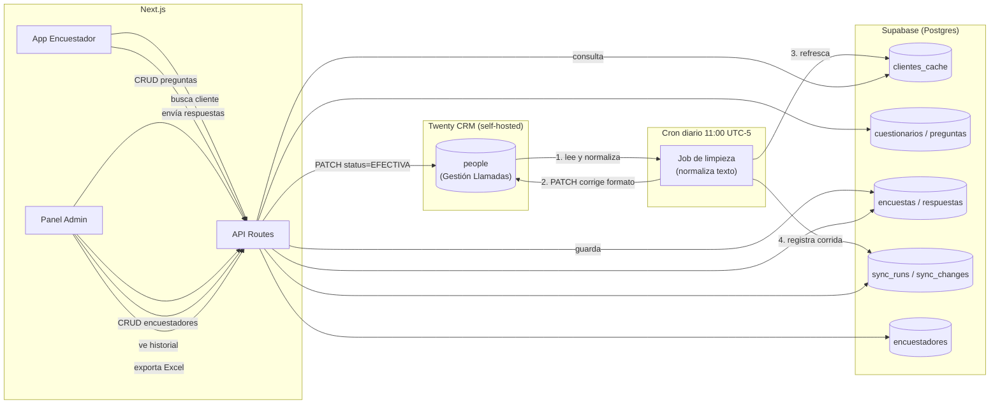

# ARCHITECTURE — Cómo se comunican los componentes

## 1. Vista general

## 2. Flujos principales

### 2.1 Limpieza autónoma de Twenty (diaria)

1. El cron dispara la API route protegida `/api/cron/sync-twenty` a las 16:00 UTC.
2. El job pagina sobre `/rest/people` en Twenty (solo `updatedAt` reciente, salvo backfill inicial que recorre todo).
3. Por cada registro, calcula el valor normalizado de los campos de texto (ver `TRD.md` §4).
4. Si el valor cambia, hace `PATCH /rest/people/{id}` en Twenty y registra el cambio en `sync_changes`.
5. Al terminar, actualiza `clientes_cache` en Supabase con los valores ya limpios.
6. Cierra la corrida con un registro resumen en `sync_runs`.

### 2.2 Encuestador levanta una encuesta

1. Abre la app, selecciona su nombre (lista de `encuestadores`).
2. Escribe el nombre del cliente → `GET /api/clientes/search?q=...` contra `clientes_cache` (nunca contra Twenty en vivo).
3. Selecciona un resultado → se autocompletan Código de cliente, PDV y Mes de Gestión (solo lectura).
4. Se carga el cuestionario activo (`GET /api/cuestionarios/activo`) con sus preguntas y condiciones.
5. Responde pregunta por pregunta; si la lógica condicional determina un corte (ej. no es quien compró), la encuesta se marca `completada: false` y termina ahí.
6. Al enviar (`POST /api/encuestas`): se guarda la encuesta + respuestas, y si se completó, se dispara `PATCH` a Twenty con `status: "EFECTIVA"`.

### 2.3 Administración

- CRUD de preguntas y de encuestadores vía API routes estándar sobre sus tablas respectivas.
- Vista de historial de corridas del cron (`sync_runs`) con detalle de cambios (`sync_changes`) para auditar qué tocó el sistema en Twenty.
- Exportación a Excel: `GET /api/encuestas/export` genera el archivo a partir de `encuestas` + `respuestas`, filtrable por encuestador, fecha y mes de gestión.

## 3. Por qué una caché y no consulta en vivo a Twenty

- Evita rate-limiting de la API de Twenty durante horas pico de llamadas (muchos encuestadores buscando al mismo tiempo).
- La búsqueda necesita ser "contiene" sobre nombre ya limpio — más simple y rápido resolverlo contra Postgres propio que reconstruir ese filtro contra Twenty en cada tecla.
- Si Twenty está lento o caído, el equipo de encuestadores puede seguir trabajando (la única dependencia dura de Twenty en tiempo real es el `PATCH` final de estado, que puede reintentarse o encolarse si falla).

## 4. Escalabilidad a futuro

El modelo separa `cuestionarios` de `preguntas`, y cada `cuestionario` puede apuntar a un `objeto_twenty` distinto (hoy `people`). Esto permite, más adelante, crear nuevos formularios conectados a otros objetos o vistas de Twenty sin rediseñar el sistema — solo agregar un nuevo `cuestionario` y sus `preguntas`, y un endpoint de búsqueda equivalente si el objeto fuente cambia.
