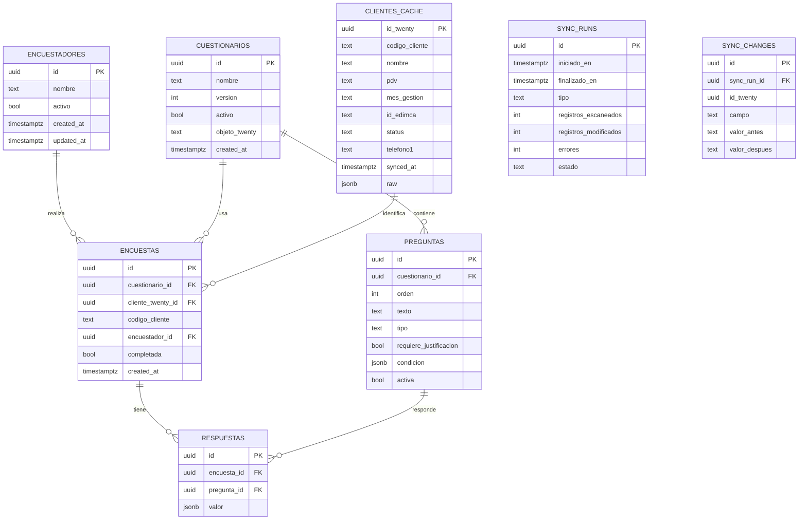

# DATABASE — Modelo de datos (Supabase / Postgres)

## 1. ERD

## 2. Definición de tablas

### `encuestadores`
| Campo | Tipo | Notas |
|---|---|---|
| `id` | uuid, PK | |
| `nombre` | text | |
| `activo` | boolean | default `true`; baja lógica, no se borra físicamente |
| `created_at` / `updated_at` | timestamptz | |

### `cuestionarios`
| Campo | Tipo | Notas |
|---|---|---|
| `id` | uuid, PK | |
| `nombre` | text | ej. "Satisfacción EDIMCA" |
| `version` | int | se incrementa al editar preguntas de forma significativa |
| `activo` | boolean | solo un cuestionario activo por `objeto_twenty` a la vez, en esta fase |
| `objeto_twenty` | text | objeto de Twenty al que está atado (`people` hoy) |
| `created_at` | timestamptz | |

### `preguntas`
| Campo | Tipo | Notas |
|---|---|---|
| `id` | uuid, PK | |
| `cuestionario_id` | uuid, FK → `cuestionarios.id` | |
| `orden` | int | orden de despliegue |
| `texto` | text | enunciado de la pregunta |
| `tipo` | text (enum aplicación) | `aceptacion_si_no` \| `escala_1_10` \| `texto_abierto` \| `opcion_multiple` |
| `requiere_justificacion` | boolean | si true, se pide un campo abierto de "¿por qué?" asociado |
| `condicion` | jsonb, nullable | `{ "pregunta_id": "...", "valor_esperado": "..." }` — si no matchea, corta la encuesta |
| `activa` | boolean | permite desactivar sin borrar histórico |

### `clientes_cache`
| Campo | Tipo | Notas |
|---|---|---|
| `id_twenty` | uuid, PK | id del registro en Twenty (`people.id`) |
| `codigo_cliente` | text, indexado | |
| `nombre` | text, indexado (búsqueda) | ya normalizado (trim + espacios colapsados) |
| `pdv` | text | normalizado |
| `mes_gestion` | text | |
| `id_edimca` | text | |
| `status` | text | espejo de `status` en Twenty |
| `telefono1` | text | |
| `synced_at` | timestamptz | última vez que se sincronizó este registro |
| `raw` | jsonb | respuesta cruda de Twenty, por trazabilidad |

Índices: `codigo_cliente`, y un índice de texto (`pg_trgm` o `to_tsvector`) sobre `nombre` para el autocompletado.

### `encuestas`
| Campo | Tipo | Notas |
|---|---|---|
| `id` | uuid, PK | |
| `cuestionario_id` | uuid, FK | |
| `cliente_twenty_id` | uuid, FK → `clientes_cache.id_twenty` | |
| `codigo_cliente` | text | copia congelada al momento de la encuesta |
| `encuestador_id` | uuid, FK → `encuestadores.id` | |
| `completada` | boolean | `false` si se cortó por lógica condicional |
| `created_at` | timestamptz | |

### `respuestas`
| Campo | Tipo | Notas |
|---|---|---|
| `id` | uuid, PK | |
| `encuesta_id` | uuid, FK | |
| `pregunta_id` | uuid, FK | |
| `valor` | jsonb | número (escalas), texto (justificación/abierta), o boolean, según `tipo` de la pregunta |

### `sync_runs`
| Campo | Tipo | Notas |
|---|---|---|
| `id` | uuid, PK | |
| `iniciado_en` / `finalizado_en` | timestamptz | |
| `tipo` | text | `dry_run` \| `incremental` \| `backfill_completo` |
| `registros_escaneados` | int | |
| `registros_modificados` | int | |
| `errores` | int | |
| `estado` | text | `en_progreso` \| `completado` \| `fallido` |

### `sync_changes`
| Campo | Tipo | Notas |
|---|---|---|
| `id` | uuid, PK | |
| `sync_run_id` | uuid, FK → `sync_runs.id` | |
| `id_twenty` | uuid | registro afectado en Twenty |
| `campo` | text | ej. `nombrePuntoVenta` |
| `valor_antes` | text | |
| `valor_despues` | text | |

## 3. Notas de diseño

- Todas las FK hacia `clientes_cache` usan `id_twenty` (el id real de Twenty) como llave, no un id propio autogenerado — así no hay ambigüedad de mapeo entre sistemas.
- `codigo_cliente` se duplica en `encuestas` (además de estar en `clientes_cache`) a propósito: si el cliente cambia de código más adelante en Twenty, la encuesta histórica conserva el valor real con el que se levantó.
- `valor` en `respuestas` es `jsonb` en vez de columnas separadas por tipo, porque el tipo de pregunta es dinámico (definido en `preguntas.tipo`) y puede cambiar sin migrar el esquema.
